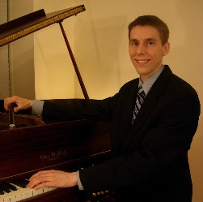

# Wright's Piano Service

**Wright's Piano Service is dedicated to professional piano tuning and service in the Maryland, Washington DC, and Northern Virginia area.**

Thomas Wright is the sole proprietor, and is an enthusiastic contributor to the musical arts in Washington DC and vicinity as a piano technician and rebuilder for all types of venues.

Quick Links:

- [About](#about)
- [Contact](#contact)
- [Maintenance](#maintenance)
- [Repairs](#repairs)
- [Service Area](#service-area)
- [Tuning](#tuning)

# [About](#about)
Thomas is a lifelong resident of Maryland, except for his travels and academic attendance which led to time spent in other states.

His experience with piano began with lessons at age 10 through his freshman year of college. Following college he embarked on a career in piano technology in 2004. His commitment to the trade has led to visits to the Steinway Factory for training, to concert venues in the Washington, DC area, and into involvement with many restoration projects. He has tuned thousands of pianos in his career so far.

Thomas' experience somewhat centers upon the restoration of Steinway B (7')  and D (9') pianos. However, he has serviced and rebuilt many other types of pianos.

Thomas has for the past 10+ years divided his time between piano restoration and everyday travels for piano tuning service calls in the MD, DC, VA area.

# [Contact](#contact)
The best way to contact Thomas is via email.

To inquire for a tuning visit, please email with a phone number and a good time to call. Or simply mention some dates and times that might work for a tuning (see below).

Email: [tomw1492@gmail.com](mailto:tomw1492@gmail.com)

Phone: [1-240-383-9345](tel:1-240-383-9345)

# [Maintenance](#maintenance)
We tend to think romantically of pianos as living creatures - because they are so beautiful. However, they are also mechanical compositions with thousands of moving action parts and many tons of string-tension.

## Regulation
Pianos benefit from regular adjustment of the action parts for ideal touch. This work is called regulation. It is best done a little at each visit, to maintain the factory specifications of the parts. However, if a piano has gone for many years with no regulation, a wholsale regulation is recommended. Proper regulation makes a big difference in the playability and expressivity of a piano.

## Voicing
Voicing is technically the maintenance of the piano hammers for ideal tone production. Most pianos become more strident and harsh in tone with time and use. This is because playing a piano compresses the felt of the piano hammers, making them harder. Voicing addresses this condition with various methods. Voicing is subjective to a certain extent, and should take both the preferences of the client and the character of the piano into account. A little maintenance voicing is best done with each tuning. However, voicing is best done when a piano is properly regulated, since regulation specifications affect voicing.

## Hammer-filing
As a piano is played, the hammers begin to show little grooves in the felt where the hammer strikes each individual string. Over time, the striking surface of the hammer loses is round contour and becomes flattened and blunt, with grooves. This condition contributes to a strained, unpleasant sound when the condition is present. If the hammers have sufficient felt intact, reshaping the hammers via filing will restore a rounder, more supple tone to a piano. This work should also involve hammer-fitting, which essentially ensures that a hammer contacts all strings in a unison simultaneously. Hammers should also rise and fall vertically and equally with their neighbors, and should be squared to the horizon, not angled. This work is called "traveling" and "squaring."

## Cleaning
The interior of a piano has areas that need to be dusted and cleaned, but are also vulnerable because they are delicate parts or because they are rust-prone (such as the strings). A skilled technician has the tools and experience to clean the interior areas of a piano safely and efficiently. It is highly recommended that one mention this work to be done with a tuning visit, as it will cost less that way. Also, if the piano has not been tuned or serviced for many years, cleaning is advisable. It can be uncomfortable and unhealthy to play, tune, or perform other work on a piano when the soundboard, strings, and action are covered with pollution and dust!

## Climate Control
We recommend Piano Life Saver Corporation products. Their system is an onboard unit that helps moderate the moisture-content of a piano soundboard, rendering its tuning more stable, and the soundboard less prone to cracking over time.

# [Repairs](#repairs)

Common Repair Needs:
- Broken String
- Sticking key
- Sticking damper causing note to continue ringing
- Loose pedal, squeaking pedal
- Note not working
- Case Damage
- Missing parts on used / recently moved piano.

Repairs are normally quoted at a service visit after evaluation. Normally the price for the repair is a fixed rate. The repair is only undertaken after the client's acceptance of the price.

Minimum service visit charge is $100 in MD and DC and Tyson's / Arlington / McLean areas of VA. However, that can be attributed toward the tuning or the actual expense of a repair. Basically, that is the cost of travel time, arriving and evaluating a piano, and reporting its condition.

# [Service Area](#service-area)

Areas normally serviced are Montgomery County, MD and adjacent counties, including Frederick, Howard, PG County, and areas of Virginia with 20 minutes of DC. Thomas also services Washington, DC and the Baltimore area.

Thomas will make exceptions on occasion to travel further, with a bit of extra travel cost.o

# [Tuning](#tuning)
We recommend Piano Tuning in the DC area every 6 months at a minimum. The client's preferences dictate the frequency beyond that basic recommendation.

If the location of the piano is climate-controlled year-round, it may need a tuning only once per year.

If a piano must be maintained close to concert pitch for use with other instruments or voice, a higher rate of frequency is advisable.

Please call or email for prices: our rates are on the modest side of the average tuning prices for professional piano technicians in this area.